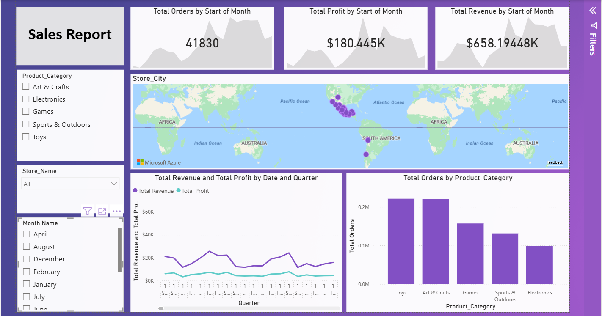

# 📊 Sales Performance Analysis — Power BI

## 📌 Project Overview
An interactive Power BI dashboard designed to analyze and track global corporate sales performance. This project aggregates business metrics including total revenue, total profit, and order distributions across multiple variables such as store locations, time periods, and core product categories to assist executive decision-making.

## 🎯 Business Questions Answered
- What are the overall high-level KPIs for orders, profit, and revenue?
- Which global store locations or cities generate the highest density of sales?
- What are the top product categories driving total order volume?
- How do sales and profits trend sequentially over different months and quarters?

## 🛠️ Tools Used

| Tool | Purpose |
|---|---|
| Power BI Desktop | Data Modeling, DAX Calculations & Dashboard Development |
| Power Query | Data Cleaning and Transformation |
| Power BI Map Visuals | Geographic Distribution Analysis |

## 💡 Key Insights
- **High-Level KPIs**: The business successfully achieved over **$658K** in total revenue and **$180.4K** in total net profit, spanning across **41.8K** total processed orders.
- **Top Product Categories**: The categories **Toys** and **Art & Crafts** significantly lead the total order distribution, closely followed by Games, while Electronics represents the lowest volume category.
- **Geographic Coverage**: Sales touchpoints span internationally with key clusters across various global coastal zones and major cities mapped effectively.

## 📁 Files

| File | Description |
|---|---|
| `project 01.pbix` | Core Power BI dashboard file containing data model, visualizations, and metrics |
| `dashboard_preview.png` | Dashboard preview screenshot |

## 📷 Dashboard Preview

## 🔗 Connect with Me
[LinkedIn](https://linkedin.com)
